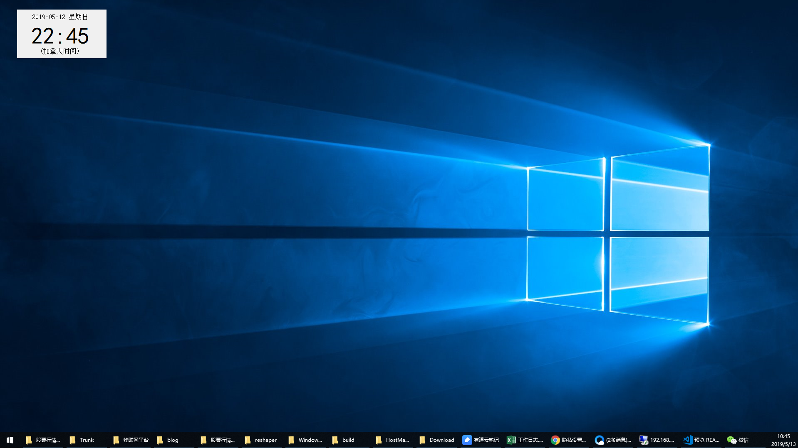

# WindowsClock
windows桌面时钟  
由于平时工作需要，需要与国外客户沟通，经常需要知道国外客户当前的时间。  
一直想找一个好用的windows桌面时钟，没有找到合适的，干脆就自己做一个。	

界面比较简单，但能满足要求，以后再完善。  	

# 功能说明
1.可以设置时区，自己定义时区，想设置哪个设置哪个。
2.支持拖放到任意位置，下次启动自动记录上次位置，显示在上次位置。

